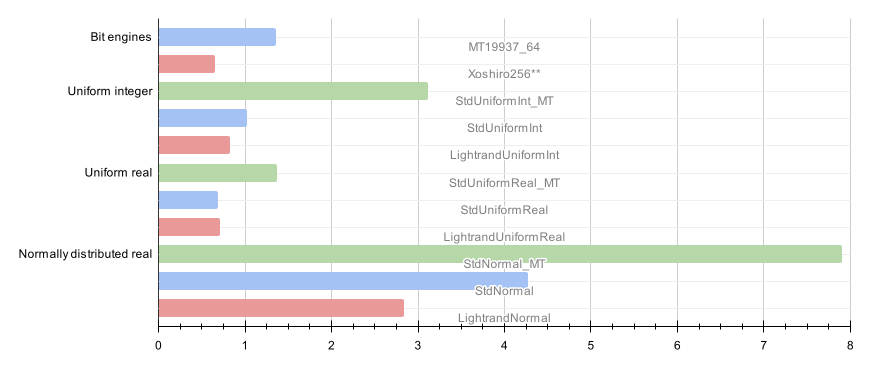

# lightrand

[](https://isocpp.org/std/the-standard)

`lightrand` is a modern C++20 library for fast, high-quality pseudo-random number generation. It provides a selection of uniform random bit generators (URBGs) and convenient wrappers for generating numbers from various statistical distributions.

## Features

*   **High-Performance PRNG:** Includes `xoshiro256**`, a fast and statistically robust generator suitable for a wide range of applications.
*   **Bias-Free Integer Generation:** Generates uniform integers within a range using rejection sampling to eliminate modulo bias.
*   **Efficient Normal Distribution:** Implements the Ziggurat algorithm for fast generation of normally distributed random numbers.
*   **Easy-to-Use API:** A high-level `generator` class simplifies common random number generation tasks.
*   **Thread-Safety:** Provides a `thread_local` generator instance for safe use in multi-threaded applications.
*   **Noise generation (beta):** Provides generators for 1D/2D/3D Perlin noise, and 2D/3D simplex noise.

##

## Requirements

*   A C++20 compatible compiler (e.g., GCC 10+, Clang 12+, MSVC 19.29+).
*   CMake (version 3.15 or newer).
*   (optional) Conan package manager.

## Building

### Building a Conan package

```bash
# 1. Clone the repository
git clone https://github.com/momchil-velikov/lightrand.git
cd lightrand

# 2. Install dependencies with Conan and build Conan package
conan create .
```

### Building with Conan

```bash
# 1. Clone the repository
git clone https://github.com/momchil-velikov/lightrand.git
cd lightrand

# 2. Install dependencies with Conan and generate CMake files.
# This creates a 'build' directory with the necessary toolchain files.
conan install .

# 3. Configure the project with CMake
cmake --preset conan-release

# 4. Build the library, tests, and benchmarks
cmake --build build/Release
```

### Building with CMake

```bash
# 1. Clone the repository
git clone https://github.com/momchil-velikov/lightrand.git
cd lightrand

# 2. Create the build directory
mkdir build && cd build

# 3. Configure the project with CMake
cmake .. -G Ninja -DCMAKE_BUILD_TYPE=Release

# 4. Build the library, tests, and benchmarks
ninja
```

## Usage

The library provides both low-level URBGs and a high-level `generator` class for convenience.

### Basic Usage (Low-level URBG)

You can directly use the `xoshiro256starstar` engine, which conforms to the C++ UniformRandomBitGenerator concept.

```cpp
#include <iostream>
#include "lightrand/random.h"

int main() {
    // Create a xoshiro256** generator with a seed
    lightrand::xoshiro256starstar rng(12345);

    // Generate 10 random 64-bit integers
    std::cout << "10 random 64-bit integers:" << std::endl;
    for (int i = 0; i < 10; ++i) {
        std::cout << rng() << std::endl;
    }
    return 0;
}
```

### High-Level `generator`

The `generator` class provides a more convenient interface for common tasks like generating numbers in a specific range or from a specific distribution.

```cpp
#include <iostream>
#include "lightrand/random.h"

int main() {
    // Use the thread-local generator instance for thread safety
    lightrand::generator gen(0, lightrand::thread_urbg);
    gen.seed(1337);

    // Generate a uniform integer in [1, 100]
    int random_int = gen.uniform<int>(1, 100);
    std::cout << "Uniform integer [1, 100]: " << random_int << std::endl;

    // Generate a uniform float in [0.0, 1.0)
    float random_float = gen.uniform<float>();
    std::cout << "Uniform float [0.0, 1.0): " << random_float << std::endl;

    // Generate a uniform double in [-5.0, 5.0)
    double random_double_range = gen.uniform<double>(-5.0, 5.0);
    std::cout << "Uniform double [-5.0, 5.0): " << random_double_range << std::endl;

    // Generate a normally distributed double (mean=0, stddev=1)
    double normal_double = gen.normal<double>();
    std::cout << "Standard normal: " << normal_double << std::endl;

    // Generate a normally distributed double with mean 10 and stddev 2
    double custom_normal = gen.normal<double>(10.0, 2.0);
    std::cout << "Normal (mean=10, stddev=2): " << custom_normal << std::endl;

    return 0;
}
```

## API Reference

### Generators

*   `lightrand::splitmix64`: A 64-bit PRNG, mainly used for seeding other generators.
*   `lightrand::xoshiro256starstar`: The default high-performance 64-bit PRNG with a 256-bit state.
*   `lightrand::global_urbg`: A global instance of `xoshiro256starstar`. Not thread-safe.
*   `lightrand::thread_urbg`: A `thread_local` instance of `xoshiro256starstar` for safe use in multi-threaded contexts.

### High-Level Interface

*   `lightrand::generator`: A high-level wrapper around a URBG.
    *   `seed(s)`: Seeds the underlying generator.
    *   `uniform<T>(lo, hi)`: Generates uniform integers or floating-point numbers in a specified range.
    *   `normal<T>(mean, stddev)`: Generates normally distributed floating-point numbers.

## Algorithms

*   **xoshiro256\*\***: Used for uniform random bit generation. It's one of the fastest high-quality generators available. More details can be found at prng.di.unimi.it.
*   **Ziggurat Algorithm**: Used for fast generation of normally distributed numbers. The implementation is based on the classic algorithm by Marsaglia and Tsang, which is significantly faster than methods like Box-Muller.

## Testing

The `lightrand::xoshiro256starstar` implementation was tested using `PractRand` on 8TB of random data with no failures.

The `lightrand::uniform<double>` and `lightrand::normal<double>` were tested using `scipy` Kolmogorov-Smirnov test with 10 million random numbers.

## Performance comparison

Following are benchmark results of lightrand against plaforms' Standard C++ libraries.

The meaning of the data points is as follows:

* Bit generators
    * `MT19937_64` - using `std::mt19937_64`
    * `xoshiro256**` - using `lightrand::xoshiro256starstar`

* Uniform integer distributions
    * **StdUniformInt_MT** - using `std::uniform_int_distribution` with `std::mt19937_64` bit engine
    * **StdUniformInt** - using `std::uniform_int_distribution` with `lightrand::xoshiro256starstar` bit engine
    * **LightrandUniformInt** - using `lightrand::generator` (with  `lightrand::xoshiro256starstar`)

* Uniform floating-point distributions
    * **StdUniformReal_MT** - using `std::uniform_real_distribution` with `std::mt19937_64` bit engine
    * **StdUniformReal** - using `std::uniform_real_distribution` with `lightrand::xoshiro256starstar` bit engine
    * **LightrandUniformReal** - using `lightrand::generator` (with  `lightrand::xoshiro256starstar`)

* Normal floating-point distributions
    * **StdNormal_MT** - using `std::normal_distribution` with `std::mt19937_64` bit engine
    * **StdNormal** - using `std::normal_distribution` with `lightrand::xoshiro256starstar` bit engine
    * **LightrandNormal** - using `lightrand::generator` (with  `lightrand::xoshiro256starstar`)

The results can be reproduced by running `random-benchmark`.

### Mac OS X / Apple M4 Max (using libc++)



### Microsoft Windows / AMD Ryzen 7 9800X3D (using MSVC STL)

TBD

## License

lightrand is distributed under the terms of the MIT license. See LICENSE for details.
